# Agent Instructions Generator - Architecture

## High-Level Architecture Diagram

```mermaid
graph TD
    subgraph INPUT["INPUT"]
        README["README.md"]
        PACKAGE["package.json"]
        ENV["env files"]
        CONFIG["Config files"]
    end

    INPUT -->|Project Analysis| PHASE1["PHASE 1: RESEARCH<br/>━━━━━━━━━━━━━━━━━<br/>• Analyze structure<br/>• Find dependencies<br/>• Detect services<br/>• Note ambiguities"]

    PHASE1 -->|Generate| RESEARCH["research.md"]
    PHASE1 --> GATE1["👤 USER APPROVAL"]
    GATE1 -->|Approved| PHASE2["PHASE 2: PLAN<br/>━━━━━━━━━━━━━━━━━<br/>• Numbered tasks<br/>• Success criteria<br/>• Verification cmds<br/>• Risk assessment"]

    PHASE2 -->|Generate| PLAN["plan.md"]
    PHASE2 --> GATE2["👤 USER APPROVAL"]
    GATE2 -->|Approved| PHASE3["PHASE 3: EXECUTE<br/>━━━━━━━━━━━━━━━━━<br/>• Follow plan<br/>• Verify each step<br/>• Stop on failure<br/>• Report completion"]

    PHASE3 -->|Generate| INSTRUCTIONS["agent-instructions.md<br/>(Machine-Executable)"]
    PHASE3 -->|Generate| HUMAN["human_tasks.md"]

    INSTRUCTIONS -->|Consumed by| AGENTS["AI AGENTS<br/>━━━━━━━━━━━━━━━━━<br/>Claude Code<br/>GitHub Copilot<br/>Cursor<br/>Other AI Agents"]

    AGENTS -->|Execute Instructions| SETUP["Project Setup &<br/>Configuration Complete"]
```

## Complete System Architecture

## Architecture Components

### Input Layer
- **README.md**: Project documentation
- **package.json**: Dependency specifications
- **.env files**: Environment configuration templates
- **Config files**: Docker, database, build configurations

### Three-Phase Workflow

#### Phase 1: Research
**Goal**: Understand the project and its requirements

- Analyzes project structure, dependencies, and configuration files
- Identifies system requirements and external services
- Detects ambiguities and missing information
- Creates `research.md` documenting all findings
- **Waits for user approval before proceeding**

#### Phase 2: Plan
**Goal**: Create a detailed execution plan

- Generates numbered task sequence with all installation steps
- Defines success criteria and verification methods for each task
- Identifies high-risk operations requiring permission
- Consolidates manual input requirements
- Creates `plan.md` with complete task breakdown
- **Waits for user approval before proceeding**

#### Phase 3: Execute
**Goal**: Execute the approved plan

- Follows the approved plan sequentially
- Verifies each step's success before proceeding
- Stops immediately on failures and reports to user
- Generates `human_tasks.md` for manual interventions

### Output Artifacts
- **research.md**: Phase 1 research findings (intermediate, for user review)
- **plan.md**: Phase 2 detailed task breakdown (intermediate, for user review)
- **human_tasks.md**: Summary of manual tasks requiring human intervention
- **agent-instructions.md**: Final machine-executable instructions (primary deliverable)

### Distribution Methods
- **Direct Prompt**: Users copy `prompt.md` and paste into any AI assistant
- **Skill Installation**: Install `setup-agent` as a reusable skill in supported AI tools (Claude Code, Cursor, etc.)

### Consumer Platforms
- Claude Code
- GitHub Copilot
- Cursor
- Other AI agents supporting custom skills or prompt input

All consumers can autonomously execute the generated `agent-instructions.md` to set up projects from scratch.
