# Agent Instructions Generator

**Stop explaining setup to AI agents. Generate machine-executable instructions instead.**

Generate comprehensive, AI-agent-friendly installation and setup instructions for any project.

## The Problem

Traditional README files are designed for human developers, making them difficult for AI agents to parse and execute reliably. They often:

- Mix conceptual explanations with setup steps
- Lack clear verification criteria for each step
- Don't specify when to stop on errors
- Require implicit knowledge about the environment
- Have ambiguous or missing configuration details

**AI agents need structured, step-by-step instructions with explicit success criteria and error handling.**

## The Solution: `agent-instructions.md`

The `agent-instructions.md` file is a machine-executable installation guide that:

- Breaks down setup into discrete, verifiable tasks
- Defines success criteria and verification methods for each step
- Includes automated detection of environment variables
- Consolidates all manual inputs (API keys, secrets) upfront
- Specifies rollback strategies for failed operations
- Requires explicit permission gates for high-risk operations

This allows AI agents to autonomously install and configure projects from scratch with minimal human intervention.

## How It Works: Three-Phase Workflow

The skill follows a structured three-phase approach with user approval gates:

### Phase 1: Research

**Goal**: Understand the project and its requirements

- Analyzes project structure, dependencies, and configuration files
- Identifies system requirements and external services
- Detects ambiguities and missing information
- Creates `research.md` documenting findings
- **Waits for user approval before proceeding**

### Phase 2: Plan

**Goal**: Create a detailed execution plan

- Generates numbered task sequence with all installation steps
- Defines success criteria and verification methods for each task
- Identifies high-risk operations requiring permission
- Consolidates manual input requirements
- Creates `plan.md` with complete task breakdown
- **Waits for user approval before proceeding**

### Phase 3: Execute

**Goal**: Execute the plan

- Follows the approved plan sequentially
- Verifies each step's success before proceeding
- Stops immediately on failures and reports to user
- Generates `human_tasks.md` for manual interventions

### Workflow Diagram

```mermaid
graph TD
    subgraph INPUT["INPUT"]
        README["README.md"]
        PACKAGE["package.json"]
        ENV["env files"]
        CONFIG["Config files"]
    end

    INPUT -->|Project Analysis| PHASE1["PHASE 1: RESEARCH<br/>━━━━━━━━━━━━━━━━━<br/>• Analyze structure<br/>• Find dependencies<br/>• Detect services<br/>• Note ambiguities"]

    PHASE1 -->|Generate| RESEARCH["research.md"]
    PHASE1 --> GATE1["👤 USER APPROVAL"]
    GATE1 -->|Approved| PHASE2["PHASE 2: PLAN<br/>━━━━━━━━━━━━━━━━━<br/>• Numbered tasks<br/>• Success criteria<br/>• Verification cmds<br/>• Risk assessment"]

    PHASE2 -->|Generate| PLAN["plan.md"]
    PHASE2 --> GATE2["👤 USER APPROVAL"]
    GATE2 -->|Approved| PHASE3["PHASE 3: EXECUTE<br/>━━━━━━━━━━━━━━━━━<br/>• Follow plan<br/>• Verify each step<br/>• Stop on failure<br/>• Report completion"]

    PHASE3 -->|Generate| INSTRUCTIONS["agent-instructions.md<br/>(Machine-Executable)"]
    PHASE3 -->|Generate| HUMAN["human_tasks.md"]

    INSTRUCTIONS -->|Consumed by| AGENTS["AI AGENTS<br/>━━━━━━━━━━━━━━━━━<br/>Claude Code<br/>GitHub Copilot<br/>Cursor<br/>Other AI Agents"]

    AGENTS -->|Execute Instructions| SETUP["Project Setup &<br/>Configuration Complete"]
```



### Why This Approach?

| Traditional README | agent-instructions.md |
|--------------------|----------------------|
| ❌ Mixed explanations/steps | ✅ Clear task sequence |
| ❌ No verification criteria | ✅ Success criteria per step |
| ❌ Ambiguous configurations | ✅ Explicit env variables |
| ❌ Assumes human knowledge | ✅ No implicit knowledge |
| ❌ No error handling guidance | ✅ Stop-on-error rules |

## Usage

You can use this prompt with any AI coding assistant (Claude, GitHub Copilot, Cursor, etc.).

### Basic Workflow

1. **Provide the prompt** to your AI assistant in your project directory (see [prompt.md](prompt.md) for the full prompt)

2. **Follow the three phases**:
   - Review the generated `agent-instructions.md`

3. **Use the instructions** with any AI assistant:

   ```text
   Follow the instructions in agent-instructions.md to set up this project
   ```

## Bonus: AI Agent Skill Setup

For AI tools that support custom skills/agents (like Claude Code), you can install this as a reusable skill.

### Installation

#### Option 1: Project-Level (Recommended for Teams)

```bash
# Clone this repository
git clone https://github.com/Montimage/agent-instructions-md.git

# Copy the skill to your project's AI config directory
# For Claude Code:
cp -r agent-instructions-md/setup-agent /path/to/your/project/.claude/skills/

# For other tools, check their documentation for skill/agent directories

# Commit to share with your team
cd /path/to/your/project
git add .claude/skills/setup-agent  # Adjust path for your AI tool
git commit -m "Add setup-agent skill"
```

#### Option 2: Personal Use (All Projects)

```bash
# Clone this repository
git clone https://github.com/Montimage/agent-instructions-md.git

# Copy to your global AI config
# For Claude Code:
cp -r agent-instructions-md/setup-agent ~/.claude/skills/

# For other tools, check their documentation for global skill directories
```

### Using the Skill

After installation, activate the skill (may require restarting your AI tool) and run:

```text
Create setup instructions for this project
```

or

```text
Generate agent-instructions.md for this project
```

## Generated Files

| File                      | Purpose                                               |
| ------------------------- | ----------------------------------------------------- |
| `research.md`             | Phase 1 findings, requirements, and ambiguities       |
| `plan.md`                 | Phase 2 detailed task breakdown and execution plan    |
| `human_tasks.md`          | Manual tasks requiring human intervention             |

## Example Output

The generated `agent-instructions.md` includes:

- **Environment Detection**: Automatic OS, version, and path detection
- **Dependency Installation**: System packages, language runtimes, libraries
- **Configuration Setup**: Environment variables, config files, API keys
- **Database Initialization**: Schema creation, migrations, seed data
- **Verification Steps**: Commands to verify each installation step
- **Rollback Procedures**: How to undo changes if needed
- **Permission Gates**: Explicit user approval for high-risk operations

## Requirements

- Any AI coding assistant (Claude, GitHub Copilot, Cursor, etc.)
- A project with standard configuration files (package.json, requirements.txt, docker-compose.yml, etc.)
- For skill installation: AI tool that supports custom skills/agents

## Contributing

Contributions welcome! Please:

1. Fork the repository
2. Create a feature branch
3. Make your changes
4. Submit a pull request

## License

MIT License - see [LICENSE](LICENSE) file for details

## Maintainer

This project is maintained by [Montimage](https://montimage.eu).

For questions or support, contact: developer@montimage.eu

## Support

For issues or questions:

- Open an issue in this repository
- Check your AI tool's documentation for specific integration details

---

**Note**: While the core prompt works with any AI coding assistant, the skill installation feature is designed for tools that support custom skills/agents (like Claude Code, Cursor, etc.). Check your AI tool's documentation for compatibility.
